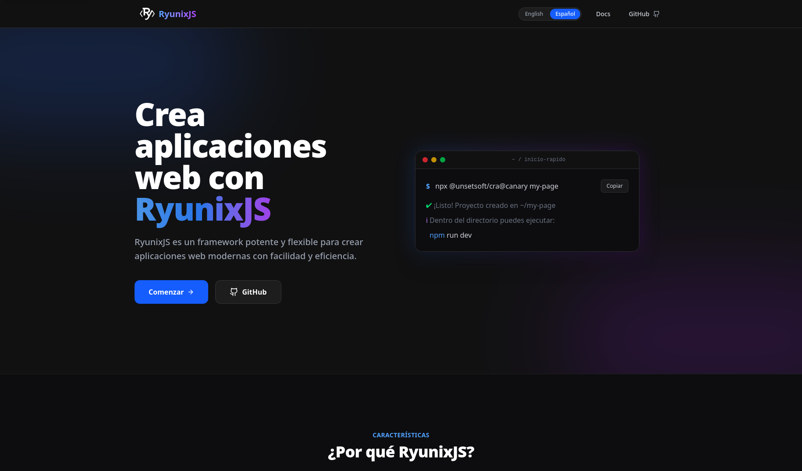

# Documentación de RyunixJS

[English](./README.md)

Sitio oficial de documentación de **RyunixJS**, un framework JavaScript moderno para crear sitios estáticos y SPAs rápidos y ligeros.



## Sobre este proyecto

Este repositorio contiene el código fuente de la documentación de RyunixJS: guías, referencia de la API y ejemplos. Está construido con el propio RyunixJS, usando MDX para el contenido y Tailwind CSS para los estilos.

## Requisitos

- [Node.js](https://nodejs.org/) 18+
- [pnpm](https://pnpm.io/)

## Instalación

```bash
git clone <repository-url>
cd ryunix-doc
pnpm install
```

## Desarrollo

```bash
pnpm dev
```

Abre [http://localhost:3000](http://localhost:3000) en el navegador.

## Scripts disponibles

Scripts definidos en `package.json` (CLI Ryunix vía `ryunix`):

| Script     | Comando         | Descripción                                            |
| ---------- | --------------- | ------------------------------------------------------ |
| `dev`      | `pnpm dev`      | Servidor de desarrollo (`ryunix dev`)                  |
| `build`    | `pnpm build`    | Build de producción (`ryunix build`)                   |
| `start`    | `pnpm start`    | Servidor de producción (`ryunix start`; tras el build) |
| `lint`     | `pnpm lint`     | Linter del proyecto (`ryunix lint`)                    |
| `lint:fix` | `pnpm lint:fix` | Corrige el lint automáticamente (`ryunix lint --fix`)  |

## Estructura del proyecto

``` txt
app/
├── components/     # Componentes reutilizables
├── docs/           # Documentación (MDX)
│   ├── introduction/
│   └── api/
├── resources/      # Recursos estáticos (logos, etc.)
├── styles/         # CSS global
├── index.ryx       # Página de inicio
└── layout.ryx      # Layout raíz
```

## Configuración

- **`ryunix.config.js`** — Ajustes de RyunixJS (MDX, SSR, alias de webpack, ESLint)

> **Aviso — `webpack.production`:** En este repositorio, `webpack.production` está en `false` en `ryunix.config.js` para desarrollo local más rápido. Ponlo en `true` antes de `pnpm build` o de desplegar a producción (p. ej. Vercel); si no, el bundle de producción no queda totalmente optimizado.

La imagen Open Graph / Twitter del sitio es `public/screenshot.png`, declarada con `export const Metatags` en `app/layout.ryx` (metadatos del App Router de RyunixJS).
- **`postcss.config.js`** — PostCSS / Tailwind CSS
- **`vercel.json`** — Despliegue en Vercel (salida del build: `.ryunix/static`)

## Despliegue

El proyecto está configurado para [Vercel](https://vercel.com/):

- **Comando de build:** `pnpm build`
- **Directorio de salida:** `.ryunix/static`

## Licencia

[MIT](./LICENSE) © [UnSetSoft](https://github.com/UnSetSoft)
